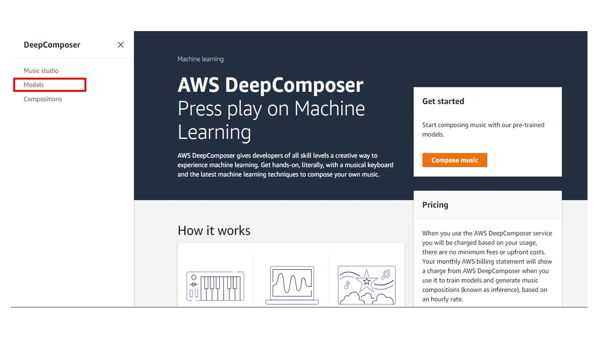
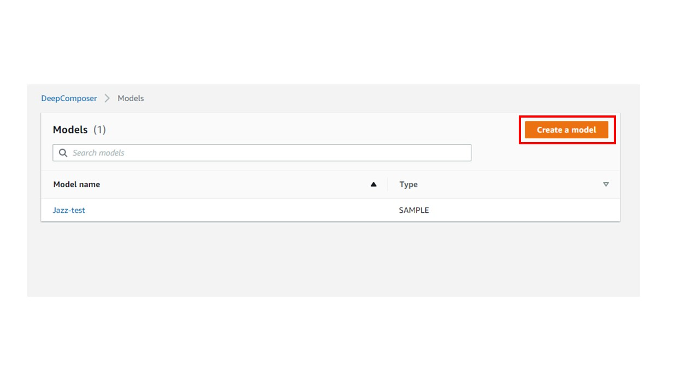
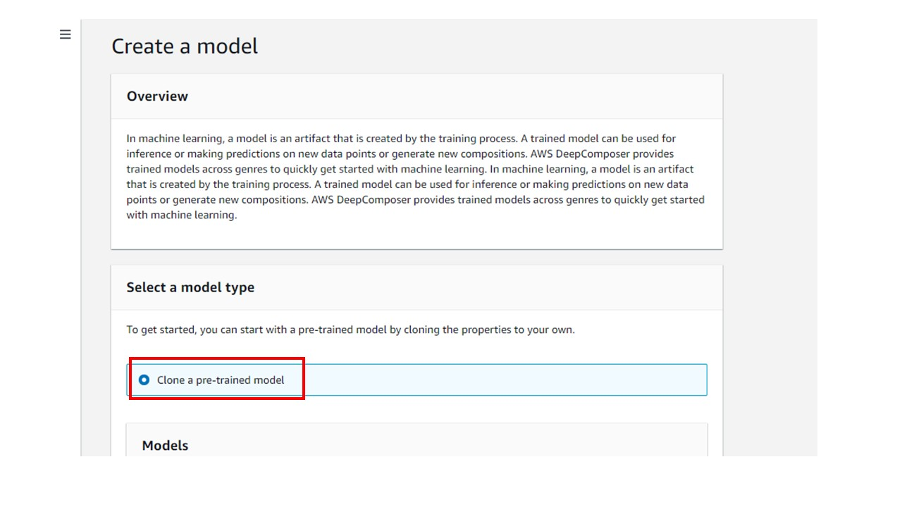
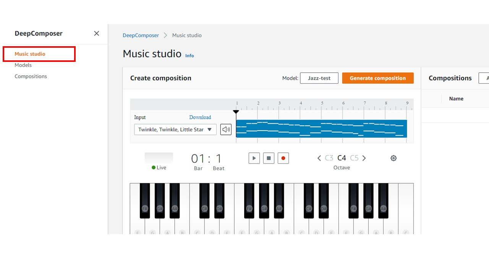

# Lab 1 - DeepComposer 모델로 음악 작곡하기

## 전제 조건: (계속 진행하기 전에 숙지하세요)
1. 본 Lab에서는 Chrome 브라우저를 사용합니다.
2. AWS DeepComposer 키보드를 연결합니다.

## AWS DeepComposer 콘솔 접근:

시작하려면 Deepcomposer 링크를 클릭하세요: https://us-east-1.console.aws.amazon.com/deepcomposer

AWS account ID, IAM Username와 Password를 입력하고 Sign In 버튼을 클릭해 주세요. 

**참고 - N.Virginia(us-east-1) AWS 리전의 콘솔에 액세스해야 합니다.** 드롭 다운을 사용하여 올바른 리전을 선택할 수 있습니다.

## 시작하기:

왼쪽 네비게이션 메뉴에서 **Models**을 선택하세요.

여러분의 계정에서 모델을 생성하려면 ***Create a model**을 클릭하세요.

AWS DeepComposer는 몇 가지 사전 학습된 모델들을 제공합니다. 이를 사용하려면 이러한 모델들을 여러분의 계정에 복제해야 합니다.

**Clone a pre-trained model**를 선택하여 모델을 계정에 복제합니다.

목록에서 원하는 모델을 선택하세요.

모델의 이름을 입력해 주세오. 모델 리스트에 모델이 여러분이 입력하신 이름으로 나타날 것입니다.

Click **Create model** to create the model in your account

왼쪽 네비게이션 메뉴에서 **Music Studio**을 클릭하세요.

기본 입력 멜로디를 연주하려면 *play*를 클릭하세요.

컴포지션(composition)을 생성하려면 **Generate composition**을 클릭하세요. AI 생성 컴포지션이 생성됩니다.

새로운 AI 생성 음악 작곡을 재생하려면 *play*를 클릭하세요.

## 입력 멜로디:

Click *record* to start recording

실제 키보드에서 음표를 연주해 봅니다.

*record* 버튼을 다시 클릭하여 녹음을 중지하세요.

녹음된 음악을 재생하여 입력을 확인하십시오. 녹음된 음악이 마음에 들지 않으면, *record*를 클릭하여 녹음을 다시 시작할 수 있습니다.

 *Model*에서 **Jazz** 모델을 선택하세요.

여러분이 제공한 입력 멜로디를 기반으로 컴포지션을 생성하려면 **Generate Composition**을 클릭하세요. *참고: 이 단계는 여러분이 선택한 장르의 음악 작품을 생성하는 데 몇 분이 소요됩니다.*

컴포지션을을 재생하고 AI기 생성한 음악을 즐기려면 *play*를 클릭하세요.

다른 장르 또는 샘플 입력 멜로디로 실험해 보세요.

**축하합니다! 사전 학습된 모델을 사용하여 새로운 음악을 생성하는 방법을 배웠습니다.**
