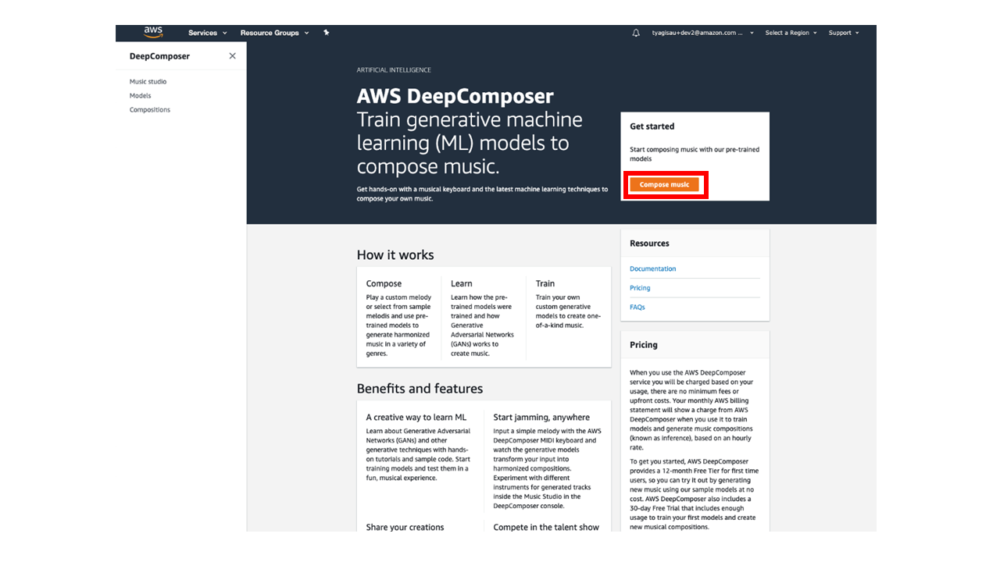
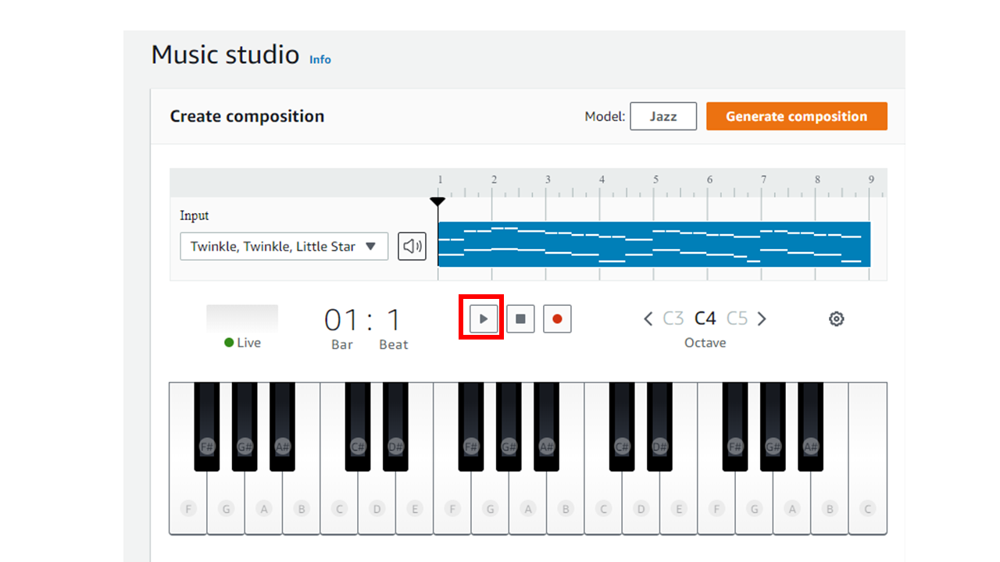
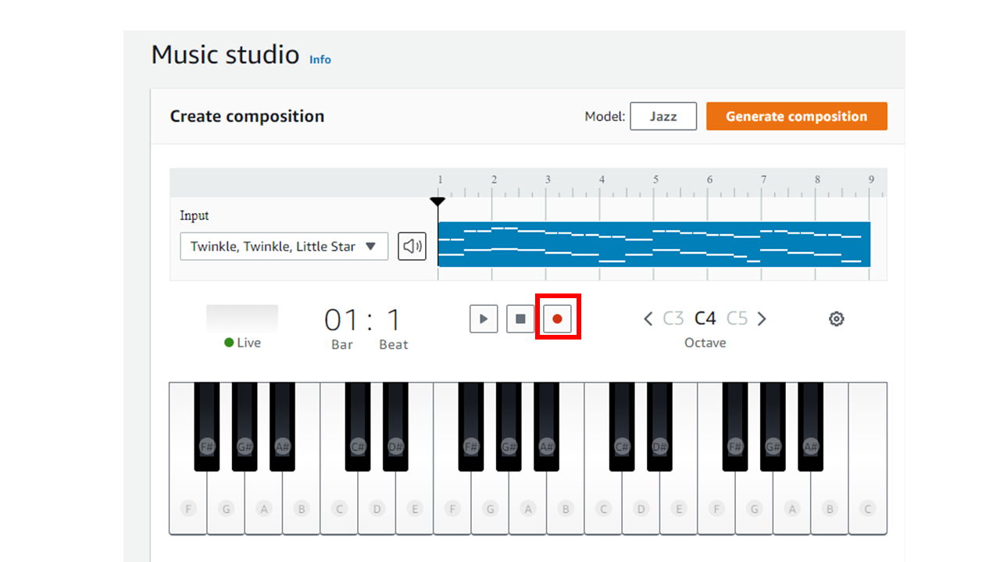
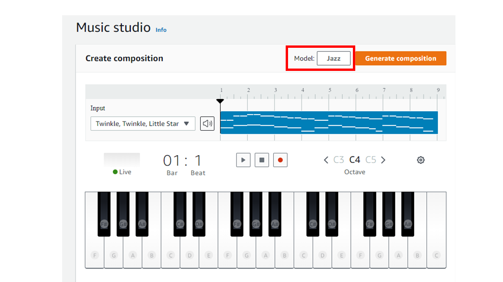

## Pre-requisites: (Read before you proceed)
1. Use Chrome Browser for this lab 
2. Plug in the AWS DeepComposer keyboard 

## Access AWS DeepComposer console:

Click on Deepcomposer link to get started: https://console.aws.amazon.com/deepcomposer

Enter AWS account ID, IAM Username and Password provided 

Click Sign In

## Get Started:

Click **Compose Music** in the Get started section

Click *play* to play the default input melody

Click **Generate composition** to generate a composition. AI generated composition will be created

Click *play* to play the new AI generated musical composition

## Input melody:

Click *record* to start recording

Play the notes on the physical keyboard provided

Stop recording by clicking the *record* button again

Play the recorded music to verify the input. In case you don’t like recorded music, you may start recording again by clicking *record*

Select **Jazz** model from *Model*

Click **Generate Composition** to generate a composition based on the input melody you provided. *Note: This step will take few minutes to generate a composition inspired by the chosen genre*

Click *play* to play the composition and enjoy the AI generated music

Try experimenting with different genres or sample input melody

**Congratulations! You have learnt how to use pre-trained models to generate new music**
