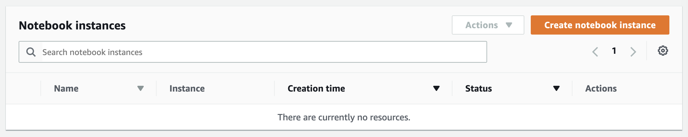
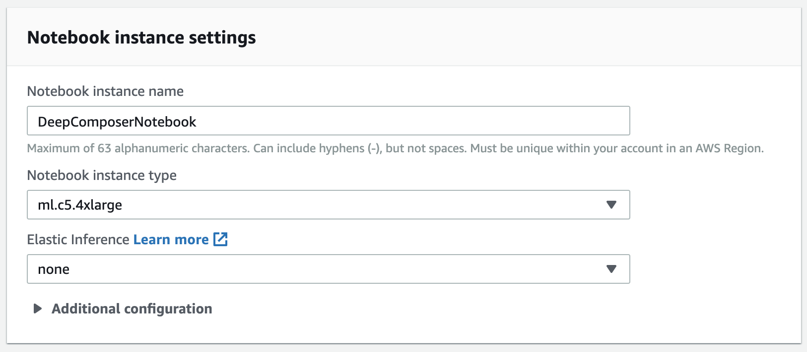
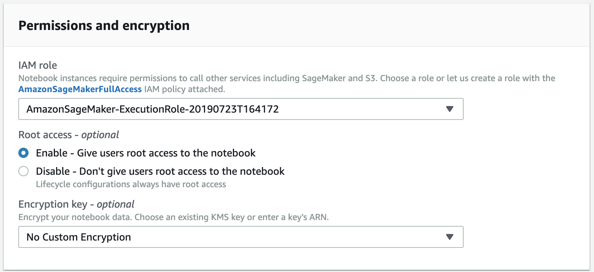
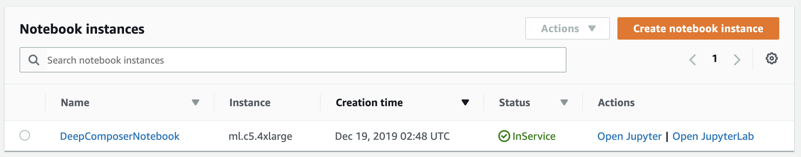

# Lab 2 - Amazon SageMaker로 사용자 정의(custom) GAN 모델 학습하기

## 목표

여러분은 이 랩에서 사용자 지정(custom) GAN 아키텍처를 구축하고 Amazon SageMaker를 사용하여 모델을 학습하는 방법을 배웁니다.

## 전제 조건(Prerequisites)

* Amazon SageMaker 접근 권한

## 비용

`ml.c5.4xlarge` 인스턴스를 사용하면 전체 학습을 실행하는 데 3-4 시간이 걸립니다. 자세한 내용은 [Amazon SageMaker 요금](https://aws.amazon.com/sagemaker/pricing/)을 참조하세요.

## 셋업

먼저 Amazon SageMaker 노트북 인스턴스를 생성합니다.

https://console.aws.amazon.com/sagemaker/home?region=us-east-1#/dashboard 링크를 사용하여 Amazon SageMaker로 이동하세요.

왼쪽 네비게이션 바(navigation bar)에서 **Notebook instances**를 클릭하세요.

**Create notebook instance**을 선택하세요.

노트북 인스턴스 생성 양식에서 **Notebook instance type**으로 "c5.4xlarge"를 선택하세요.

**Permissions and encryption**에 대해 아래 사항들을 설정해 주세요:
* IAM role: Use an existing role or create a new role
* Root access: Enable
* Encryption key: No Custom Encryption

**Git repositories**에 대해 아래 사항들을 설정해 주세요:
* Repository: Clone a public Git repository to this notebook instance only
* Git repository URL: https://github.com/aws-samples/aws-deepcomposer-samples

**Open Jupyter**를 클릭하세요.

**Lab 2** 폴더를 클릭하고, **GAN-ko.ipynb** 파일을 클릭해 주세요.

*커널(kernel)을 선택하라는 메시지가 표시될 수 있습니다. 드롭 다운(Drop down)을 선택하고 커널로 **conda_python3**을 선택하세요.*

이 jupyter 노트북에는 사용자 정의 GAN 모델을 밑바닥부터(from scratch) 작성하는 지침과 코드가 포함되어 있습니다. 노트북 내용을 따라 모든 코드 셀(code cell)을 끝까지 실행하십시오.

코드 셀을 실행하려면 실행할 코드 셀을 선택하고 **Run**을 클릭하세요. (Shift+Enter 단축키로도 동일 작업을 수행하실 수 있습니다.)

커널에 빈 원이 있다면, 그것은 코드를 실행할 준비가 되어 있음을 의미합니다.

커널에 채워진 원이 있으면 사용 중임을 의미합니다. 다음 코드 셀을 실행하기 전에 이가 해제될 때까지 기다려 주세요.

## 다음 단계

**밑바닥부터(from stratch) 사용자 정의 GAN 모델을 구축하신 것을 축하합니다!**

이제 모델을 사용하여 사용자 정의 MIDI 입력 데이터를 기반으로 작곡을 해 보세요.

**중요: 추가 과금을 피하기 위해 Lab 완료 후 Amazon SageMaker 인스턴스를 중지해야 합니다.**

