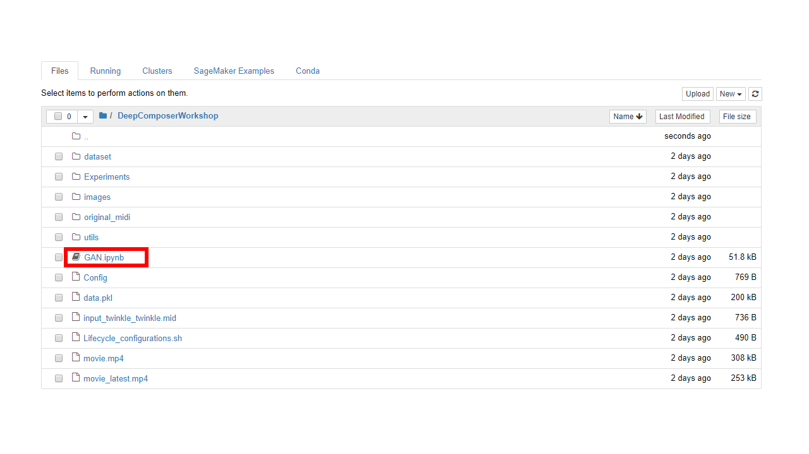
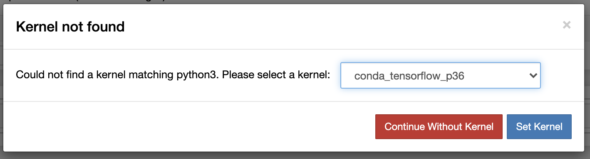

**Lab 2- Train a custom GAN model**

As part of this lab, you will learn to build a custom GAN architecture and train the model. Follow the steps below:

Navigate to Amazon SageMaker using the link: https://console.aws.amazon.com/sagemaker/home?region=us-east-1#/dashboard

Click **Notebook instances** from the left navigation bar

Click **Open Jupyter**

Click **DeepComposerWorkshop** folder

Click **GAN.ipynb**

*If you come across the above error, choose the drop down and select **conda_python3** as the kernel*

Select **conda_python3** as the kernel and click **set kernel**

This notebook contains instructions and code to create a custom GAN model from scratch. Scroll through the notebook content.

To run the code cells, choose the code cell you want to run and click **Run**

If the kernel has an empty circle, it means it is free and ready to execute the code 

If the kernel has a filled circle, it means it is busy. Wait for it to become free before you execute the next line of code.

**Congratulations on building a custom GAN model from scratch!** 
